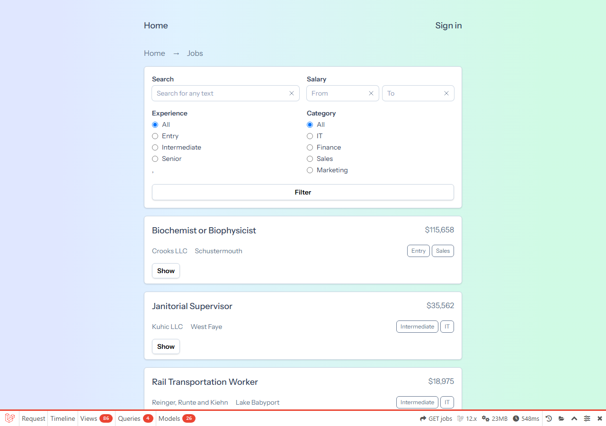
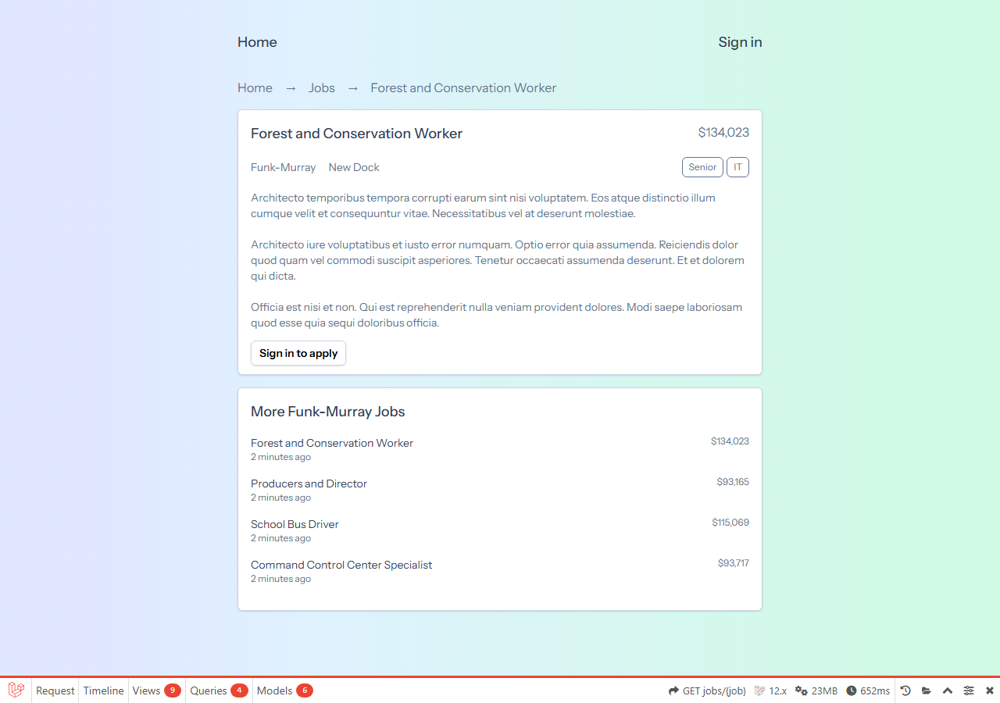

# Job Portal

A Laravel 12 job-board application: browse and filter a seeded catalog of job listings
(search, salary range, experience level, category), sign in and apply to a job with an
expected salary plus a PDF CV, or register as an employer to post and manage your own
listings. Backed by SQLite, with policy-driven authorization — employers own their jobs,
a job with applications can't be edited, and each user can apply to a job only once.

> **New developer? Start with [`.docs/tldr.md`](.docs/tldr.md)** — every doc summarised on one
> page. The full guide lives in [`.docs/`](.docs/README.md).





## Prerequisites

| Tool | Version | Installed by |
| --- | --- | --- |
| PowerShell + winget | Windows 10/11 stock | — (the only true prerequisites) |
| Git | any recent | `setup.ps1` (winget) |
| PHP | 8.4 (app requires ^8.2) | `setup.ps1` (php.net zip → `%LOCALAPPDATA%\Programs\php-8.4`) |
| Composer | 2.x | `setup.ps1` (getcomposer.org, next to PHP) |
| Node.js + npm | LTS | `setup.ps1` (winget) — Vite asset build |
| uv + Python | latest | `setup.ps1` — used by `.claude` tooling |
| just | any recent | `setup.ps1` |
| Claude Code CLI | latest | `setup.ps1` (optional, for AI-assisted dev) |

## Quick start

```powershell
# 1. One-time machine setup (idempotent — safe to re-run)
pwsh ./setup.ps1

# 2. Close and reopen PowerShell so PATH updates land

# 3. One-time app bootstrap: composer + npm deps, .env, sqlite db, migrate, build assets
just bootstrap

# 4. Optional: seed the catalog (300+ users, 21 employers, 103 jobs). DROPS existing local data.
just fresh

# 5. Start the dev server
just start
```

The app is now at **http://127.0.0.1:8108**. Stop it with `just stop`.

## Demo accounts

`just fresh` always seeds two deterministic logins (both with password `password`):

| Email | Password | Role |
| --- | --- | --- |
| `akmal@gmail.com` | `password` | Job seeker — no pre-seeded applications, so every job can be applied to fresh |
| `employer@gmail.com` | `password` | Employer — owns **Akmal Recruitment Sdn Bhd** with jobs (and incoming applications) under **My Jobs** |

Sign in as the job seeker to browse, filter and apply (expected salary + PDF CV); sign in
as the employer to post, edit and review applications on your own listings.

## Tests

`just test` runs the PHPUnit feature suite (green — 11 tests / 32 assertions) against an
in-memory sqlite database (`phpunit.xml` overrides `DB_CONNECTION`/`DB_DATABASE`), so the
seeded dev database is never touched. What's covered:

| Suite | Proves |
| --- | --- |
| `SmokeTest` | `/` redirects to the job listing, `/jobs` renders seeded jobs, guests get "Sign in to apply" (not "already applied") |
| `JobPolicyTest` | An employer cannot edit a job once it has applications (403), cannot touch another employer's job, and a user cannot apply twice to the same job |
| `JobApplicationCvTest` | CV uploads must be PDF and ≤ 2 MB — rejects `cv.exe` and oversized files with nothing stored; a valid PDF lands on the private `local` disk |
| `DatabaseSeederTest` | The seeder always produces the two demo accounts above with their exact roles |

```powershell
just test                             # whole suite
just test --filter=JobPolicyTest      # one class
```

## Commands

Run `just` with no arguments to list every recipe. The ones you'll use daily:

| Command | What it does |
| --- | --- |
| `just bootstrap` | One-time app setup: deps, `.env`, sqlite db, migrations, asset build |
| `just start` | Serve on http://127.0.0.1:8108 in a background window (runs `stop` first) |
| `just serve` | Serve in the foreground (Ctrl+C to stop) — handy for request logs |
| `just stop` | Stop only THIS repo's `php.exe` serve process(es) |
| `just migrate` | Run pending migrations |
| `just fresh` | Drop everything, re-migrate and re-seed (IRREVERSIBLE locally) |
| `just test` | Run the test suite (`php artisan test`); pass flags: `just test --filter=X` |
| `just lint` | Check code style with Laravel Pint (read-only) |
| `just lint-fix` | Auto-fix code style with Laravel Pint |
| `just claudex` | Launch Claude Code (Sonnet, all permissions) |

## Troubleshooting

### `/jobs` shows no listings

The database starts empty — migrations create tables but no rows. Run `just fresh` to seed
300+ users, 21 employers and 103 jobs. (`just fresh` drops existing local data first.)

### `PHP 8.4 not found at ...` when running a recipe

`setup.ps1` hasn't run on this machine (or was interrupted). Run `pwsh ./setup.ps1`, close
and reopen PowerShell, then retry.

### Port 8108 already in use

Another serve process is lingering. `just stop` kills only this repo's `php.exe`; if the
port is held by something else, find it with `netstat -ano | findstr :8108`.

More in [`.docs/06-troubleshooting/common-issues.md`](.docs/06-troubleshooting/common-issues.md).

## Project layout

```
job-portal/
  app/
    Enums/                  # JobCategoryEnum, JobExperienceEnum
    Http/Controllers/       # Job, JobApplication, MyJob, MyJobApplication, Employer, Auth
    Http/Middleware/        # EmployerMiddleware (redirects non-employers off /my-jobs)
    Http/Requests/          # JobRequest, StoreJobApplicationRequest, StoreEmployerRequest, LoginRequest
    Models/                 # Job (offered_jobs, SoftDeletes), Employer, JobApplication, User
    Policies/               # JobPolicy, EmployerPolicy
    Providers/              # AppServiceProvider (registers both policies)
    View/Components/        # Breadcrumbs, Label, RadioGroup, TextInput
  bootstrap/, config/       # stock Laravel 12 config (cache/session/queue on database)
  database/
    migrations/             # users/cache/jobs (stock) + offered_jobs + job_applications + employers
    factories/, seeders/    # Job/Employer/JobApplication/User factories, DatabaseSeeder
  resources/
    views/                  # job/{index,show}, my_job/*, job_application/create, my_job_application/index, employer/create, auth/login, components/
    css/, js/               # Vite inputs (Tailwind 4 entry, Alpine.js boot)
  routes/web.php            # public jobs index/show + auth group (applications, employer, my-jobs)
  tests/                    # Feature tests: smoke, policies, CV validation, seeder (sqlite :memory:)
  justfile, setup.ps1       # dev recipes + one-time machine setup
  .docs/                    # full documentation set (start at .docs/tldr.md)
  .claude/                  # Claude Code skills, hooks, settings
```
